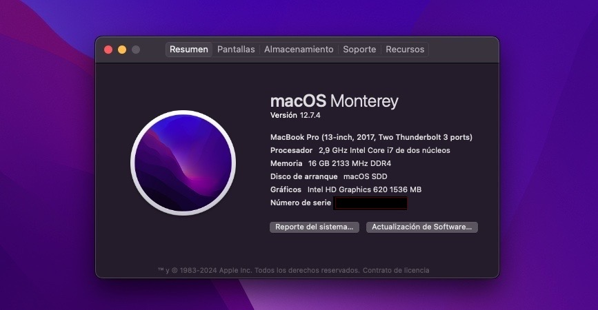
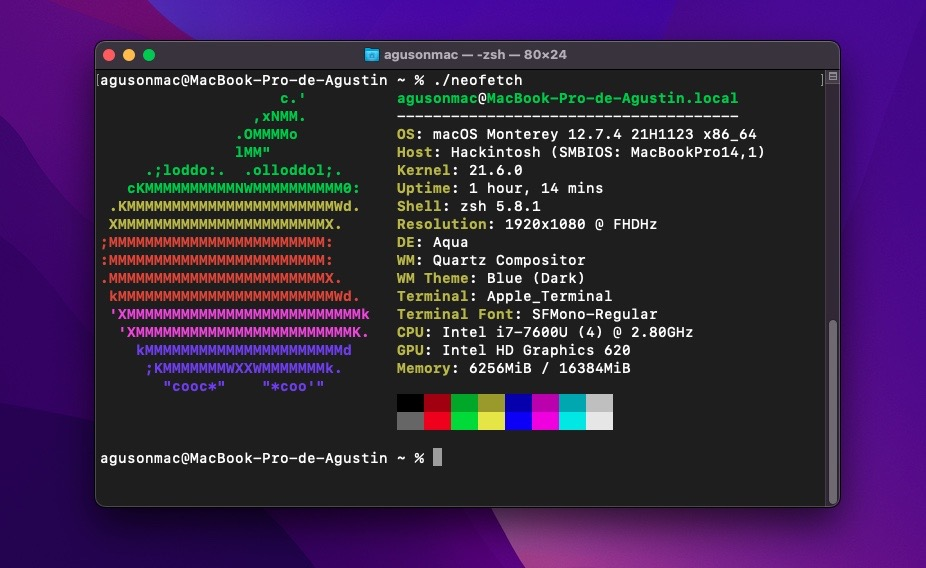
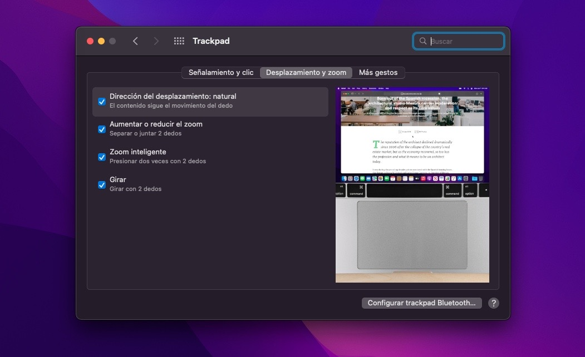

# Hackintosh Dell Latitude 7480 - macOS Monterrey

  

Este repositorio contiene la configuración EFI (OpenCore) que,  **me funciono a mi** para ejecutar macOS Monterey (Versión 12.7.4) en una Dell Latitude 7480.

| About This Mac | Neofetch |
| :---: | :---: |
|  |  |

## 💻 Especificaciones de Hardware

| Componente | Detalle | Notas |
| :--- | :--- | :--- |
| **Modelo** | Dell Latitude 7480 | |
| **CPU** | Intel Core i7-7600U | Kaby Lake |
| **GPU** | Intel HD Graphics 620 | Aceleración gráfica completa |
| **RAM** | 16 GB | DDR4 |
| **Almacenamiento** | SK hynix SC308 S | SATA M.2 |
| **Audio** | Realtek ALC3246 (ALC256) | Layout ID: 11 |
| **Ethernet** | Intel I219-LM | |
| **Touchpad** | ALPS I2C | Requiere configuración especial AlpsHID |
| **Wifi/BT** | Intel Dual Band Wireless-AC | Requiere AirportItlwm |

## BIOS

Para arrancar correctamente, la BIOS debe estar configurada así:

* **SATA Operation:** AHCI
* **Secure Boot:** Disabled
* **Touchpad/Mouse:** "Touchpad/PS-2 Mouse" (Crítico para que el touchpad funcione en modo I2C/ALPS)
* **Virtualization (VT-d):** Disabled (o usar `DisableIoMapper` en config.plist)
* **Fast Boot:** Minimal o Disabled

## 📂 Kexts Críticos y Orden de Carga

### Orden de Carga del Kernel (Crucial)
El orden de los Kexts en `config.plist` -> `Kernel` -> `Add` es estricto para evitar Kernel Panics:

1.  **Lilu.kext**
2.  **VirtualSMC.kext**
3.  **WhateverGreen.kext**
4.  **AppleALC.kext**
5.  **VoodooPS2Controller.kext** (Teclado)
6.  **VoodooPS2Keyboard.kext** (Plugin)
7.  **VoodooI2CServices.kext**
8.  **VoodooGPIO.kext**
9.  **VoodooInput.kext** (Versión de VoodooI2C - Enabled: True)
10. **VoodooI2C.kext**
11. **VoodooI2CHID.kext** (Versión modificada para compatibilidad ALPS)
12. **AlpsHID.kext** (Driver satélite específico para Dell ALPS)

> **Nota:** `VoodooPS2Trackpad.kext` y el `VoodooInput` que viene dentro de PS2 deben estar **Desactivados (False)** en el config.plist.

### Parches ACPI (SSDTs)
Ubicados en `EFI/OC/ACPI`:
* `SSDT-EC-USBX-LAPTOP.aml` (Gestión de energía embebida)
* `SSDT-PLUG-DRTNIA.aml` (Gestión de energía CPU)
* `SSDT-PNLF.aml` (Brillo de pantalla)
* `SSDT-XOSI.aml` (Simulación de Windows para activar I2C)
* *(Desactivado)* `SSDT-GPI0.aml` (Genera conflictos en este modelo específico)

### Argumentos de Arranque (Boot-Args)
`NVRAM` -> `Add` -> `7C436110-AB2A-4BBB-A880-FE41995C9F82`:

* `-v`: Modo verbose (texto de arranque).
* `keepsyms=1 debug=0x100`: Depuración de pánicos.
* `alcid=11`: Habilita el audio (altavoces y micrófono).
* `-vi2c-force-polling`: **Obligatorio y optimizado** para que el touchpad ALPS funcione de manera estable en modo Polling. El modo interrupción (GPIO) es inestable en este panel ALPS específico de Dell.
  > **Nota:** Este boot arg es necesario porque el touchpad ALPS en el Dell Latitude 7480 tiene problemas de pinning GPIO y el ACPI de Dell no proporciona la información de interrupción correcta. El modo polling ha sido optimizado para minimizar la latencia.
  
  > **Configuración Optimizada**: Se han reducido los tiempos de "QuietTimeAfterTyping" en AlpsHID (200ms) y VoodooI2CHID (50ms) para mejorar la respuesta del touchpad en modo polling.
  

  

## 🛠 Herramientas y Recursos Utilizados

Este proyecto no sería posible sin las siguientes herramientas y documentación:

* **[Dortania's OpenCore Install Guide](https://dortania.github.io/OpenCore-Install-Guide/):** La biblia del Hackintosh.
* **[Lovely-XPP's Hackintosh Guide](https://github.com/Lovely-XPP/Dell-Latitude-E7480-Hackintosh/tree/main):** Repo de mucha ayuda.
* **[OpenCore Pkg](https://github.com/acidanthera/OpenCorePkg):** Bootloader.
* **[ProperTree](https://github.com/corpnewt/ProperTree):** Editor de `.plist` multiplataforma (Python).
* **[GenSMBIOS](https://github.com/corpnewt/GenSMBIOS):** Para generar números de serie únicos (SMBIOS MacBookPro14,1).
* **[USBMap](https://github.com/corpnewt/USBMap) / [USBToolBox](https://github.com/USBToolBox/tool):** Para el mapeo correcto de puertos USB y evitar problemas de reposo/encendido.
* **[Hackintool](https://github.com/headkaze/Hackintool):** Herramienta de diagnóstico post-instalación.
* **[MaciASL](https://github.com/acidanthera/MaciASL):** Para compilar y editar parches ACPI (.dsl a .aml).

## 📝 To Do 

- [x] **Eliminar logs de arranque (Verbose):**
    - Quitar `-v` y `debug=0x100` de `boot-args`.
    - En `Misc -> Debug`, desactivar `Target` (poner a 3 o 0) y `ApplePanic`.
- [x] **Optimizar Touchpad ALPS en Modo Polling:**
    - ✅ Se optimizó el modo polling reduciendo latencias de respuesta
    - ✅ AlpsHID: QuietTimeAfterTyping reducido de 500ms a 200ms
    - ✅ VoodooI2CHID: QuietTimeAfterTyping reducido de 100ms a 50ms
    - ✅ Documentación completa sobre por qué GPIO no es viable
    - **Nota:** El modo GPIO no es estable en este modelo debido a problemas de pinning GPIO en touchpads ALPS de Dell. El modo polling optimizado es la mejor solución para este hardware específico.
- [ ] **Autoinicio directo (Skip OpenCore Menu):**
    - `Misc` -> `Boot` -> `ShowPicker`: **False**.
    - `Timeout`: **5**.
    - `PollAppleHotKeys`: **True** (Permite usar ESC para mostrar menú en emergencia).

### Posibles mejoras
- [ ] **Gestión de Energía Avanzada (CPUFriend):** Generar `CPUFriendDataProvider.kext` para optimizar frecuencias del i7-7600U.
- [ ] **Interfaz Gráfica (OpenCanopy):** Instalar tema visual para el selector de arranque.
- [ ] **Hibernación:** Desactivar hibernación profunda.

## ⚠️ Disclaimer
La información de **PlatformInfo** (Números de Serie, UUID, MLB y ROM) ha sido eliminada del `config.plist`.
**Debes generar tus propios seriales usando GenSMBIOS.**
