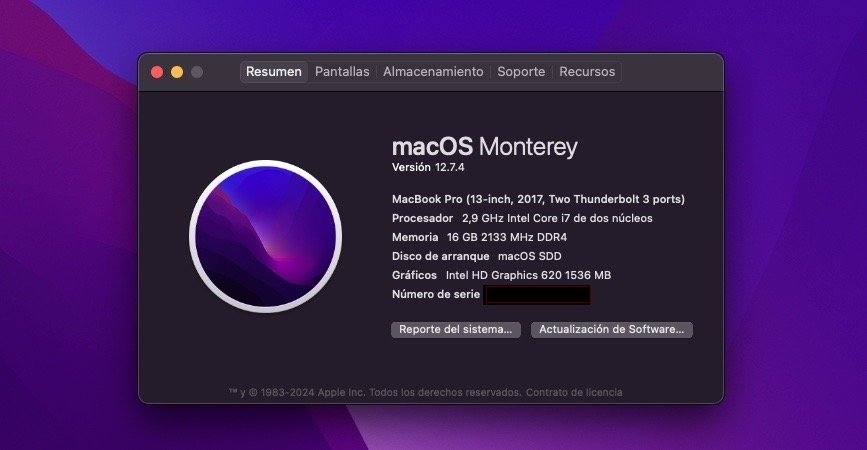
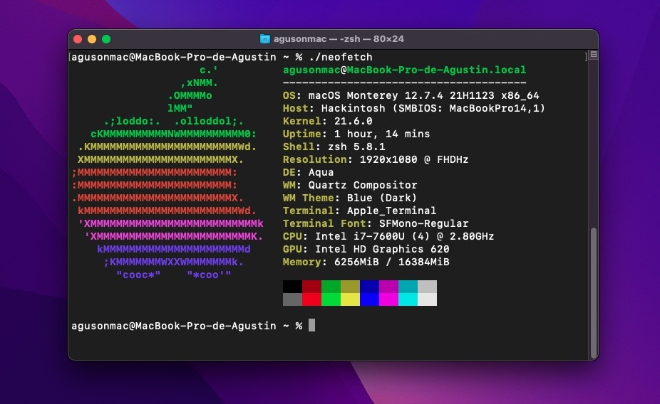
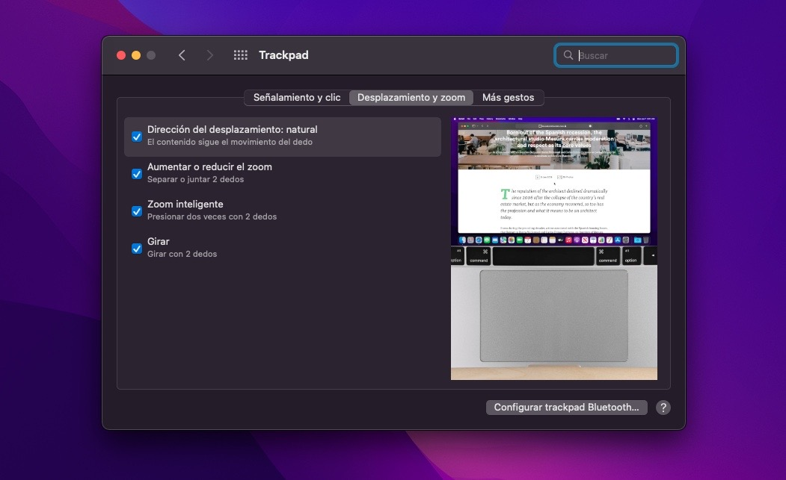

# Hackintosh Dell Latitude 7480 - macOS Monterey

  

This repository contains the EFI (OpenCore) configuration that **worked for me** to run macOS Monterey (version 12.7.4) on a Dell Latitude 7480.

| About This Mac | Neofetch |
| :---: | :---: |
|  |  |

## 💻 Hardware Specifications

| Component | Detail | Notes |
| :--- | :--- | :--- |
| **Model** | Dell Latitude 7480 | |
| **CPU** | Intel Core i7-7600U | Kaby Lake |
| **GPU** | Intel HD Graphics 620 | Full graphics acceleration |
| **RAM** | 16 GB | DDR4 |
| **Storage** | SK hynix SC308 S | SATA M.2 |
| **Audio** | Realtek ALC3246 (ALC256) | Layout ID: 11 |
| **Ethernet** | Intel I219-LM | |
| **Touchpad** | ALPS I2C | Requires special AlpsHID setup |
| **Wi-Fi/BT** | Intel Dual Band Wireless-AC | Requires AirportItlwm |

## BIOS

To boot correctly, set the BIOS as follows:

* **SATA Operation:** AHCI
* **Secure Boot:** Disabled
* **Touchpad/Mouse:** "Touchpad/PS-2 Mouse" (critical for touchpad support in I2C/ALPS mode)
* **Virtualization (VT-d):** Disabled (or use `DisableIoMapper` in config.plist)
* **Fast Boot:** Minimal or Disabled

## 📂 Critical Kexts and Load Order

### Kernel Load Order (Crucial)
The kext order in `config.plist` -> `Kernel` -> `Add` is strict to avoid kernel panics:

1.  **Lilu.kext**
2.  **VirtualSMC.kext**
3.  **WhateverGreen.kext**
4.  **AppleALC.kext**
5.  **VoodooPS2Controller.kext** (Keyboard)
6.  **VoodooPS2Keyboard.kext** (Plugin)
7.  **VoodooI2CServices.kext**
8.  **VoodooGPIO.kext**
9.  **VoodooInput.kext** (VoodooI2C version - Enabled: True)
10. **VoodooI2C.kext**
11. **VoodooI2CHID.kext** (Modified version for ALPS compatibility)
12. **AlpsHID.kext** (Specific satellite driver for Dell ALPS)

> **Note:** `VoodooPS2Trackpad.kext` and the `VoodooInput` bundled with PS2 must be **Disabled (False)** in config.plist.

### ACPI Patches (SSDTs)
Located in `EFI/OC/ACPI`:
* `SSDT-EC-USBX-LAPTOP.aml` (Embedded power management)
* `SSDT-PLUG-DRTNIA.aml` (CPU power management)
* `SSDT-PNLF.aml` (Display brightness)
* `SSDT-XOSI.aml` (Windows simulation to enable I2C)
* *(Disabled)* `SSDT-GPI0.aml` (Causes conflicts on this specific model)

### Boot Arguments (Boot-Args)
`NVRAM` -> `Add` -> `7C436110-AB2A-4BBB-A880-FE41995C9F82`:

* `-v`: Verbose mode (boot text output).
* `keepsyms=1 debug=0x100`: Kernel panic debugging.
* `alcid=11`: Enables audio (speakers and microphone).
* `-vi2c-force-polling`: **Currently required** for touchpad cursor functionality (polling mode), because interrupt mode (GPIO) is unstable on this ALPS panel.
  > **Note:** `-vi2c-force-polling` does not affect cursor usage with an external mouse; that works normally.
  

  

## 🛠 Tools and Resources Used

This project would not be possible without the following tools and documentation:

* **[Dortania's OpenCore Install Guide](https://dortania.github.io/OpenCore-Install-Guide/):** The Hackintosh bible.
* **[Lovely-XPP's Hackintosh Guide](https://github.com/Lovely-XPP/Dell-Latitude-E7480-Hackintosh/tree/main):** Very helpful repository.
* **[OpenCore Pkg](https://github.com/acidanthera/OpenCorePkg):** Bootloader.
* **[ProperTree](https://github.com/corpnewt/ProperTree):** Cross-platform `.plist` editor (Python).
* **[GenSMBIOS](https://github.com/corpnewt/GenSMBIOS):** To generate unique serial numbers (SMBIOS MacBookPro14,1).
* **[USBMap](https://github.com/corpnewt/USBMap) / [USBToolBox](https://github.com/USBToolBox/tool):** For proper USB port mapping and to avoid sleep/wake issues.
* **[Hackintool](https://github.com/headkaze/Hackintool):** Post-installation diagnostic tool.
* **[MaciASL](https://github.com/acidanthera/MaciASL):** To compile and edit ACPI patches (.dsl to .aml).

## ⚠️ Disclaimer
**PlatformInfo** data (Serial Numbers, UUID, MLB, and ROM) has been removed from `config.plist`.
**You must generate your own serials using GenSMBIOS.**
